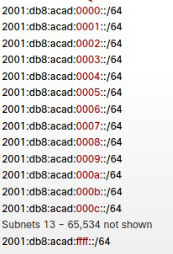

# **IPv6**

## TOC
- [**IPv6**](#ipv6)
  - [TOC](#toc)
  - [**Aufbau \& Schreibweise**](#aufbau--schreibweise)
    - [**Typen**](#typen)
      - [Unicast-Adressen](#unicast-adressen)
        - [Global Unicast Address (GUA)](#global-unicast-address-gua)
        - [Link Local Address (LLA)](#link-local-address-lla)
        - [Andere Unicast Adressen](#andere-unicast-adressen)
      - [Multicast Adressen](#multicast-adressen)
  - [**Subnetting**](#subnetting)
  - [**Dynamic Addressing**](#dynamic-addressing)
    - [Stateless Address Autoconfiguration (SLAAC)](#stateless-address-autoconfiguration-slaac)
    - [Extended Unique Identifier (EUI64)](#extended-unique-identifier-eui64)

## **Aufbau & Schreibweise**
Damit Geräte miteinander kommunizieren können, bestehen folgende möglichkeiten:

> **Dual IP-Stack**:\
> IPv4 und IPv6 werden gleichzeitig genutzt

> **Tunneling:**\
> IPv6 Pakete werden mithilfe eines Tunnels durch ein IPv4 Netzwerk geleitet.

> **Übersetzung (NAT64)**:\
> IPv4 wird bei bedarf von einem Router in IPv6 übersetzt

Eine IPv6-Adresse ist ein 128-Bit lang. Anstatt der Basis 10 (Deziaml) wird nun die Basis 16 (Hexadezimal) verwendet. Die IPv6-Adresse besteht aus 8 Blöcken, ein Block hat 4 Hexadezimal-Zahlen (0001:0002:0003:0004:0005:0006:0007:0008).

Unter Beachtung von folgenden Regeln, kann eine IPv6-Adresse gekürzt dargestellt werden.
> 
> **Regel 1:**\
> Führende Nullen dürfen entfernt werden \
> 2001:0DB8:0000:1111:0000:0000:0000:0200\
> 2001:<del>0</del>DB8:<del>0000</del>:1111:<del>000</del>0:<del>000</del>0:<del>000</del>0:<del>0</del>200\
> = 2001:DB8:0:1111:0:0:0:200

> **Regel 2:**\
> Aufeinander folgende Nullen können mit zwei Doppelpunkten zusammengefasst werden. (Nur einmal pro Adresse!!)\
> 2001:DB8:0:1111:0:0:0:200\
> 2001:DB8:0:1111:<del>0:0:0</del>:200\
> = 2001:DB8:0:1111::200
> 

### **Typen**

#### Unicast-Adressen

##### Global Unicast Address (GUA)
Für die Global Unicast Adressen wird akutell der Bereich von **2000:... bis 3FFF:...** verwendet. Dabei wird der Bereich von **2001:DB8::/32** für Dokumentation reserviert. Eine GUA ist für die IPv6-Kommunikation nicht zwingend notwending.

> **Vorsicht:**\
> mit einer konfigurierten GUA ist ein Rechner direkt aus dem Internet erreichbar. Eine **Firewall im LAN** und eine **Host- Firewall** ist daher notwendig.

Die GUA setzt sich foglendermaßen zusammen:

##### Link Local Address (LLA)
Link Local Adressen (LLAs) liegen in dem Bereich zwischen **FE80:… und FEBF:…**. LLAs werden nicht geroutet. Damit ein Gerät mittels IPv6 kommunizieren kann, muss es eine LLA besitzen. Adressen können manuell konfiguriert werden, sollte die konfiguration aber nicht passen, erzeugt das Gerät selbstständig eine LLA. Das Default-Gateway hat in der Regel eine GUA und eine LLA. Üblicherweise wird aber die LLA als Default-Gateway verwendet. 

##### Andere Unicast Adressen
- Loopback Address&nbsp;&nbsp;&nbsp;&nbsp;&nbsp;&nbsp;&nbsp;&nbsp;-> ::1/128
- Unspecified Address &nbsp;&nbsp;&nbsp;&nbsp;-> ::/128
- Uniqe Local Address &nbsp;&nbsp;&nbsp;&nbsp;-> FC00::/7 bis FDFF::/7
- Embedded IPv4

#### Multicast Adressen
Die Multicast Adressen werden verwendet um ein Paket an ein oder mehrere Ziele zu senden. Sie besitzen den Präfix **FF00::/8**. Multicast Adressen können aus Sicherheitsgründen nur als Empfänger in einem Paket andgegeben werden und nicht als Absender. In der Regel gibt es 2 Typen von Multicast Adressen.

- Well-known Multicast Adressen
    > **FF02::1 | All-Nodes Multicast Gruppe**\
    > Ersetzt weitgehend die IPv4 Broadcastadresse.
    
    > **FF02::1 | All-Routers Multicast Gruppe**\
    > Nur für Router bestimmt.

- **Solicited Node Multicast Adressen**\
    Funktioniert ähnlich wie die All-Nodes Multicast Adresse. Sie fungiert als spezielle Ethernet-Mutlicast-Adresse. Dabei checken Geräte schon auf Layer 2, ob der Frame für sie bestimmt ist. Findet Verwendung bei der **Neighbor Discovery** und der **Duplicate Address Detection (DAD)**.

## **Subnetting**

\
Da das Subnetting von Beginn an geplant war, müssen keine Bits aus dem bereich der Intefface-ID genommen werden. Vorteil, man muss nichts in Binär umrechnen, da Subnetze einfach nur hochgezählt werden.\
&nbsp;&nbsp;&nbsp;&nbsp;&nbsp;&nbsp;&nbsp;&nbsp;\
Jedes Subnetz wird für ein Netzwerksegment verwendet, klingt nach Verschwendung, ist aber aufgrund der hohen Anzahl an Adressen kein Porblem.

## **Dynamic Addressing**
Bei der dynamischen Adressvergabe gibt es 3 betriebsmöglichkeiten:

> **Option 1: SLAAC only**\
> Präfix, Präfix-Länge, Default-GW, DNS-Server und mehr Infos werden über RA verteilt.

> **Option 2: SLAAC mit Stateless DHCPv6-Server**\
> Präfix, Präfix-Länge und Default-GW werden per RA verteilt. DNS-Server und weitere Infos werden über DHCPv6-Server verteilt

> **Option 3: Stateful DHCPv6-Server (kein SLAAC)**\
> All Infos kommen vom DHCPv6-Server

### Stateless Address Autoconfiguration (SLAAC)
Mithilfe von SLAAC können Geräte ihre Adresen selbst konfiguren, dabei wird kein DHCP-Server benötigt. Ein Router sendet periodisch eine **Router-Advertise-Nachricht (RA)**in sein Netzwerk. Diese Nachricht enthält ein Präfix (z.B. 2001:db8::/64) und noch weitere Konfigurations-Optionen. Geräte können aber auch eine konfiguration mittels **Router-Solicitation-Nachrichten (RS)** anfordern. Clients erzeugen ihre Interface ID selbst, dabei können sie das mitgelieferte Präfix in der RA-Nachricht verwenden. 

### Extended Unique Identifier (EUI64)
Bei der Adressgenereierung mittels EUI64 wird die MAC-Adresse(48-Bit) des gerätes verwendet. Dabei wird eine MAC z.B. **00:1A:2B:3C:4D:5E** in 2 Stücke aufgeteilt (je 24-Bit) **00:1A:2B** und **3C:4D:5E**.\
Im 2. Schritt wird die HEX-Sequenz **FF:FE** zwischen die 2 hälften gepackt. -> **00:1A:2B:FF:FE:3C:4D:5E**\
Anschließend wird das U/L-Bit geflipt. Das U/L-Bit befindet sich in dem ersten Part der MAC-Adresse **00:1A:2B** -> in Binär  U/L-Bit 0000 0000. Dieses Bit muss von 0 auf 1 oder von 1 auf 0 gesetzt werden. In disem Fall wird es 0000 0010 -> in HEX **02:1A:2B**.\
Die darauß generierte Adresse ist **02:1A:2B:FF:FE:3C:4D:5E**.\
Im letzten Schritt wird nun das Präfix an die Adresse gehängt, um die IPv6-Adresse zu generieren. Dazu kann das Präfix aus der RA-Nachricht verwendet werden (z.B. **2001:db8::/64**). Die daraus Resultierende Adresse ist: **2001:db8::021A:2BFF:FE3C:4D5E**.

