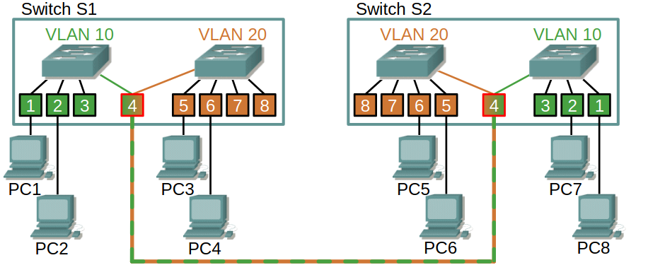

# Switch

## TOC
- [Switch](#switch)
  - [TOC](#toc)
  - [Allgemein](#allgemein)
  - [Rekap: Grundfunktionen einese Switches](#rekap-grundfunktionen-einese-switches)
  - [Wie gestalte ich ein Netz möglichst sicher?](#wie-gestalte-ich-ein-netz-möglichst-sicher)
    - [Angriffe auf ein Netz](#angriffe-auf-ein-netz)
  - [Schutzmaßnahmen beim Switch](#schutzmaßnahmen-beim-switch)
    - [DHCP-Spoofing](#dhcp-spoofing)
    - [Port Securtiy](#port-securtiy)
      - [Was passier bei einer Sicherheitsverletzung?](#was-passier-bei-einer-sicherheitsverletzung)
    - [SSH](#ssh)
  - [DHCP Relay Agent](#dhcp-relay-agent)
- [VLANs](#vlans)
  - [Definition](#definition)
  - [Vorteile](#vorteile)
  - [Trunk](#trunk)
  - [Header](#header)
  - [Nativ VLAN](#nativ-vlan)
  - [Best Pratice](#best-pratice)
  - [Inter-VLAN-Routing](#inter-vlan-routing)

## Allgemein
Switches findet man meistens im Acces Layers eines hierarchischen Netzwerkmodells und ist für den User-Datenverkehr zuständig.

## Rekap: Grundfunktionen einese Switches
> **Learning**\
> Switch speichert die MAC-Adressen eingehender Frames in seiner MAC-Adresstabelle ab und verknüpft diese Information mit dem Port des Switches von dem der Frame kommt.

> **Selective Forwarding**\
> Frames werden zielgerichtet an den Port mit der zugehörigen MAC-Adresse geschickt.

> **Aging**\
> Nach einer bestimmten Zeit werden die einträge in der MAC-Adress-Tabell automatisch gelöscht.

> **Flooding**\
> Switch leitet einen Frame an alle Ports, falls die MAC-Adresse des Frames nicht bekannt ist.

> **Filtering**\
> Switch filter z.B. defekte Frames. 

> **Store and Forward**\
> Switch speichert den Frame und sendet ihn erst nach Korrektheitsprüfung weiter.

> **Cut Trough:**\
> - **Fast Forward:**\
>   Frame wird direkt weitergeleitet.
> - **Fragment Free:**\
>   Switch leitet Frames nur weiter, wenn sie eien mindestlänge von 512 Bit haben.

> **Adaptive Cut-Through**\
> Kombination aus Cut-Trough und Store-and-Forward.

> **Kollisionsdomänen**\
> 

## Wie gestalte ich ein Netz möglichst sicher?

### Angriffe auf ein Netz

> **Flooding**\
> Beim Flooding befüllt der Angreifer solange den MAC-Adress-Table mit gefälschten MAC-Adressen, bis dieser voll ist. Der Switch verhält sich nun wie ein HUB (alle Packete werden an jeden weitergeleitet).

> **DCHP Starvation**\
> Der Angreifer simuliert eine vielzahl an Clients, sodass der reguläre Adressbereich des DHCP-Servers komplett aufgebraucht ist. Dadurch können sich keien neuen Geräte ins Netz einwählen -> Denail of Service

> **DHCP-Spoofing**\
> Der Angreifer betreibt einen eigenen DHCP-Server, wodurch der Angreifer den Datenverkehr abhören kann.

## Schutzmaßnahmen beim Switch
Generell sollte das Cisco Discovery Protocol (CDP) ausgeschaltet werden. Zudem wird empfohlen, ungenutzte Ports herunterzufahren. Nicht genutzte Dienste, wie z.B. ein Webserver sollten abgeschalten werden.

### DHCP-Spoofing
Um DHCP-Spoffing in einem Netzwerk zu verhindern kan DHCP-Snooping aktiviert werden. Dies schaltet zunächste alle Ports als sog. "Untrusted Ports". Diese Untrusted Ports leiten nur DHCP-Anfragen weiter. Antworten von einem DHCP-Server können nur durch sog. "Trusted Ports", die zuvor konfiguriert werden müssen, weitergeletitet werden.

### Port Securtiy
Port-Security ist eine Sicherheitsfunktion in Netzwerkswitches, die den Zugriff auf Netzwerkports einschränkt, indem nur autorisierte MAC-Adressen pro Port zugelassen werden. Damit lässt sich steuern, welche Geräte sich mit einem bestimmten Port verbinden dürfen, um unautorisierte Zugriffe oder Netzwerkausfälle zu verhindern.

> **Festlegung der erlaubten MAC-Adressen pro Port:**\
>  Eine bestimmte Anzahl an erlaubten MAC-Adressen kann für jeden Port festgelegt werden. Wird die erlaubte Anzahl überschritten oder eine nicht erlaubte MAC-Adresse erkannt, greift eine definierte Reaktion.

> **Varianten der erlaubten MAC-Adressen:**
> - **Static Secure MACs**: Manuelle konfiguration, bleibt gespeichert
> - **Dynamic Secure MACs**: Adressen werden automatisch gelernt, jedoch nach einem Neusttart wieder vergessen.
> - **Sticky Secure MACs**: Dynamisch gelernete Adressen werden in die Running-Config geschrieben und bleiben nach einem Neustart erhalten.

#### Was passier bei einer Sicherheitsverletzung?
Eine Sicherheitsverletzung tritt auf, wenn:
  - eine nicht erlaubte MAC erkannt wird
  - eine neue MAC auftaucht
  - die maximale anzahl an erlaubten MACs überschritten wurde.

Meist wird mit folgender Reaktion darauf geantowrtet:
  - **Protect**: Frames werden verworfen, kein Log
  - **Restrict**: Frames werden verworfen, Log + Zähler erhöhen
  - **Shutdown**: Der Port wird deaktiviert, bis zur manuellen reaktivierung

### SSH
Secure Shell oder Secure Socket Shell ist ein Protokoll, welches den Zugriff auf ein Gerät über das Netzwerk bietet. Um SSH auf einem Switch zu aktiveren müssen ein Paar dinge beachtet werden. \
**User** mit **Paswort** generiern und einen **Domainname** festlegen. Anschließend müssen Schlüsselpaare generiert werden. Damit das ganze auch von Außen erreichbar ist muss noch der SSH-Server afuf dem Switch gestartet weden.

## DHCP Relay Agent 
Ein DHCP Relay Agent leitet DHCP-Anfragen von Clients an einen DHCP-Server weiter, wenn sich beide in verschiedenen Subnetzen befinden. Da DHCP normalerweise auf Broadcasts basiert, die Router nicht über Netzgrenzen hinweg übertragen, hilft der Relay Agent dabei, DHCP-Nachrichten als Unicast an den Server zu senden. Das ermöglicht die zentrale Verwaltung von IP-Adressen über mehrere Subnetze hinweg und reduziert den Broadcast-Traffic.

# VLANs
- Normal Range (1 -1005)
- Extend Range (1006 - 4094)

## Definition
Ein VLAN ist ein seperates logisches Netzwerk auf OSI-Layer 2. Ein Switch kann mehrere VLANs besitzen, dabei wird ein Port des Switches einem VLAN zugewiesen. Frames werden nur innerhalb eines VLANs weitergeleitet (logische Abgrenzung).\
Bsp. Schüler & Lehrer Netzwerk:\

## Vorteile
Durch das nutzen von VLANs ergeben sich foglende Vorteile:
- BC- & MC-Domänen sind kleiner.
- Erhöhte Sciherheit, da Datenverkehr auf Layer 2 gsetrennt wird.
- Kosteneinsparung (weniger Hardware, optimierte Nutzung der Hardware)

## Trunk
Durch Trunk Ports können die Daten aller VLANs mit nur einer Verbindung zwischen den Switches übertragen werden. Frames auf einer Trunk-Leitung erhalten eine Kennzeichnung (tag) mit ihrem zugehörigem VLAN.

## Header
Der eingefügte Tag hat eine Länge von 4 Bytes und enthält die VLAN-ID. Beim einfügen des Tags (tagging) muss die FCS des Frames neu berechnet werden.

## Nativ VLAN
Wird ein Frame ohne VLAN-Tag über den Trunk-Port geschickt, wird dieser Frame dem Native-VLAN zugeordnet. Diese Frames werden verworfen. Der Default für das Native VLAN ist VLAN1, dies sollte aber aus Sicherheitsgründen abgeändert werden.

## Best Pratice
Best Practices beim VLAN Design sind:
- Alle Ports aus VLAN 1 entfernen und in ein anderse VLAN legen.
- Native VLAN von Trunks in ein seperates unbenutztes VLAN weiterleiten (Blackhole).
- Management VLAN in eigenes VLAN legen
- Keine Ports mit Dynamic Trunking Modes verwenden
- DTP-Aushandlung ausschalten
- Voice-Traffic in eigenes VLAN

## Inter-VLAN-Routing
Mithilfe eines Routers kann der Datenaustausch zwischen zwei VLANs realisiert werden.
\
Normalerweise wird für jedes VLAN ein seperates physikalisches Router-Interface benötigt.
\
Wird allerdings eine Trunk Verbinung verwendet, wird nur eine Physikalische Verbindung benötigt.\
