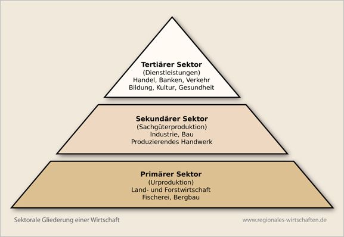
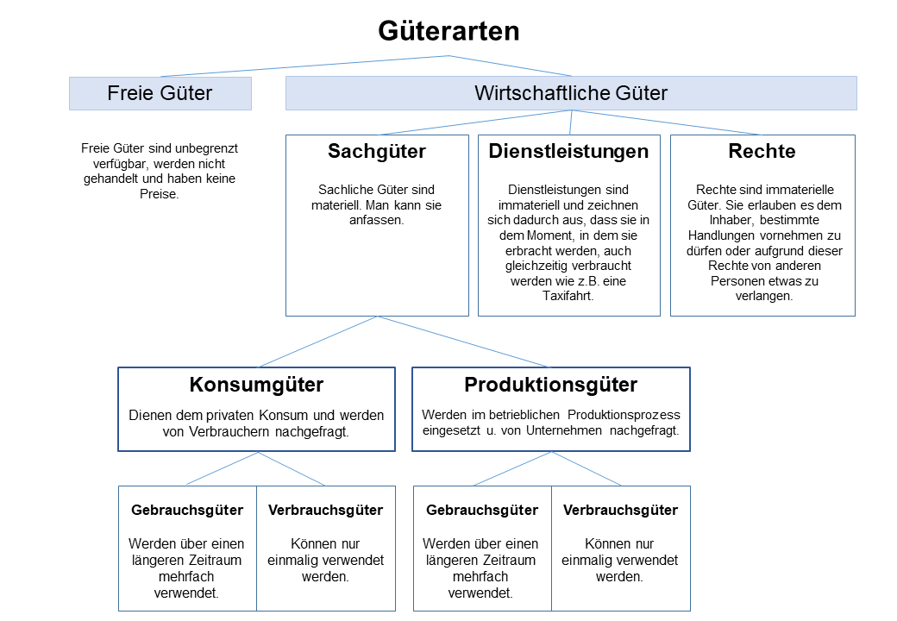
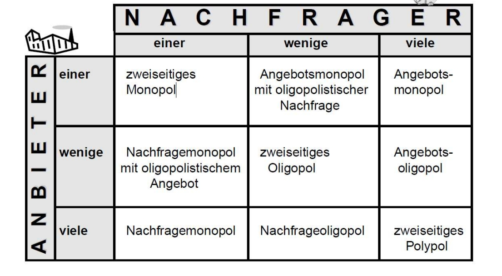

# Der Markt

## TOC
- [Der Markt](#der-markt)
  - [TOC](#toc)
  - [Wirtschaftssektoren](#wirtschaftssektoren)
  - [Güterarten](#güterarten)
  - [Güter- und Faktormarkt](#güter--und-faktormarkt)
  - [Marktformen](#marktformen)

## Wirtschaftssektoren
Grundsätzlich unterscheidet man zwischen drei Wirtschaftssektoren. In den letzten Jahren ist jedoch ein vierter Sektor hinzugekommen. Die klassische Pyramidenstruktur hat sich dabei gewandelt: Der tertiäre Sektor wächst stetig, während der primäre Sektor zunehmend an Bedeutung verliert.
- **Primärer Sektor**: Urproduktion: Landwirtschaft, Forstwirtschaft, Fischerei, Bergbau, Energieerzeugung
- **Sekundärer Sektor**: Güterproduktion: Industrie, Bau, produzierendes Handwerk
- **Tertiärer Sektor**: Dienstleistungen: Handel, Bankwesen, Verkehr/Transport, Bildungsleistungen, Kulturleistungen, Gesundheitsleistungen, Mensch-zu-Mensch-Leistungen
- **Quartiärer Sektor**: Erstellen und Verarbeiten von Daten

## Güterarten

## Güter- und Faktormarkt
- **Gütermärkte**:
  - Waren
  - Dienstleistungen
  - Immobilien
- **Faktormärkte**:
  - Arbeitsmarkt
  - Kapitalmarkt
  - Devisenmarkt

> Alle Märkte werden zudem nach räumlicher Ausdehnung unterschieden (Lokal/Regional, National, International & Weltmarkt) 

## Marktformen
**Monopol**:
- Ein Anbieter bzw. ein Nachfrager
- Kein Wettbewerb
- Monopolist beherrscht den Markt und bestimmt den Preis

**Polypol**:
- Viele Anbieter, viele Nachfrager
- Starker Wettbewerb
- Keine erhöhte Machtposition für einzelne Marktteilnehmer
- Angebot und Nachfrage regeln den Preis

**Oligopol**:
- Wenige Anbieter bzw. wenige Nachfrager
- Reaktion der Konkurrenz muss bei Preisänderungen beachtet werden
- Gefahr illegaler Preisabsprachen (Kartellbildung)
- Zusammenschluss von Firmen wird stark kontrolliert

