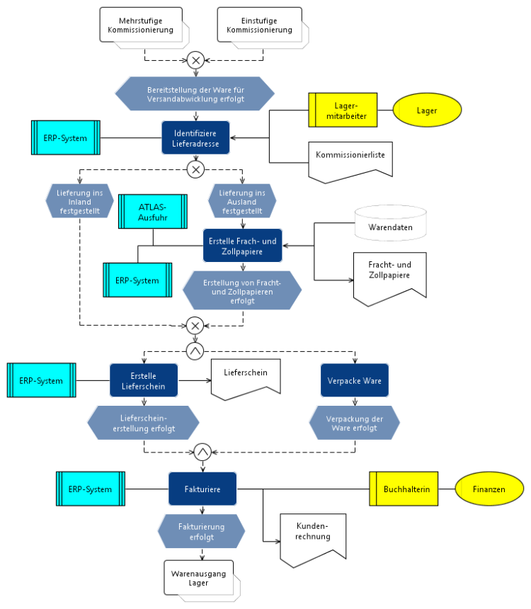

# EPK & eEPK

## TOC
- [EPK \& eEPK](#epk--eepk)
  - [TOC](#toc)
  - [EPK](#epk)
    - [EPK Elemente](#epk-elemente)
    - [Beispiel EPK](#beispiel-epk)
  - [Erweiterte Ereignisgesteuerte Prozesskette (eEPK)](#erweiterte-ereignisgesteuerte-prozesskette-eepk)
    - [eEPK Elemente](#eepk-elemente)
    - [Beispiel eEPK](#beispiel-eepk)

## EPK
Die Ereignisgesteuerte Prozesskette (EPK) ist eine Modellierungsmethode zur Darstellung von Geschäftsprozessen. Sie besteht aus Ereignissen (die einen Zustand beschreiben) und Funktionen (die Aktivitäten oder Prozesse darstellen), die durch Kanten miteinander verbunden sind. Zusätzlich können logische Operatoren (UND, ODER, XOR) verwendet werden, um Verzweigungen und Parallelverarbeitung darzustellen.\
Die EPK wird häufig im Geschäftsprozessmanagement und in ERP-Systemen (z. B. SAP) genutzt, um Abläufe transparent und strukturiert zu visualisieren.

### EPK Elemente

### Beispiel EPK

## Erweiterte Ereignisgesteuerte Prozesskette (eEPK)
Die Erweiterte Ereignisgesteuerte Prozesskette (eEPK) ist eine Weiterentwicklung der klassischen EPK und ergänzt sie um zusätzliche Elemente wie Organisationsobjekte, Informationsobjekte und Anwendungsysteme.

Neben Ereignissen, Funktionen und logischen Operatoren können in der eEPK auch Ressourcen (z. B. Rollen, Abteilungen), Datenobjekte (z. B. Dokumente) und IT-Systeme (z. B. Software) integriert werden. Dadurch ermöglicht die eEPK eine detailliertere und realitätsnähere Modellierung von Geschäftsprozessen.

### eEPK Elemente

### Beispiel eEPK
