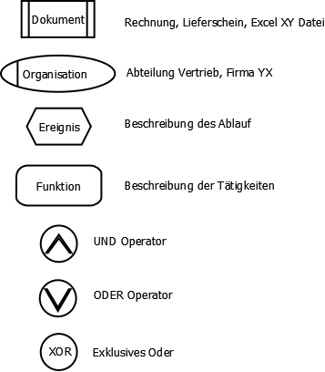
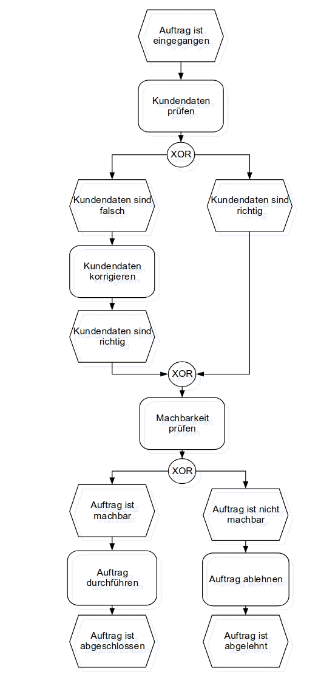

# EPK (Ereignisgesteuerte Prozesskette)

## TOC
- [EPK (Ereignisgesteuerte Prozesskette)](#epk-ereignisgesteuerte-prozesskette)
  - [TOC](#toc)
  - [Allgemein](#allgemein)
  - [EPK Elemente](#epk-elemente)
  - [Beispiel](#beispiel)

## Allgemein 
Die Ereignisgesteuerte Prozesskette (EPK) ist eine Modellierungsmethode zur Darstellung von Geschäftsprozessen. Sie besteht aus Ereignissen (die einen Zustand beschreiben) und Funktionen (die Aktivitäten oder Prozesse darstellen), die durch Kanten miteinander verbunden sind. Zusätzlich können logische Operatoren (UND, ODER, XOR) verwendet werden, um Verzweigungen und Parallelverarbeitung darzustellen.\
Die EPK wird häufig im Geschäftsprozessmanagement und in ERP-Systemen (z. B. SAP) genutzt, um Abläufe transparent und strukturiert zu visualisieren.

## EPK Elemente

## Beispiel
