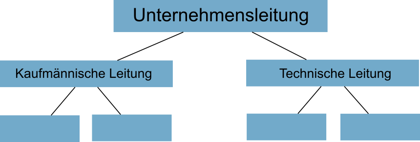
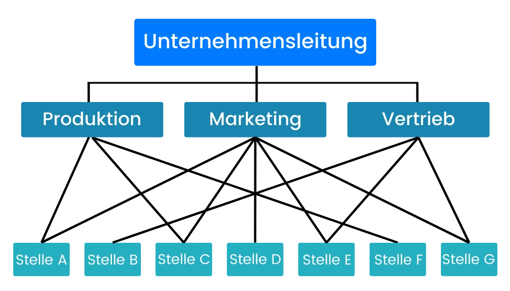
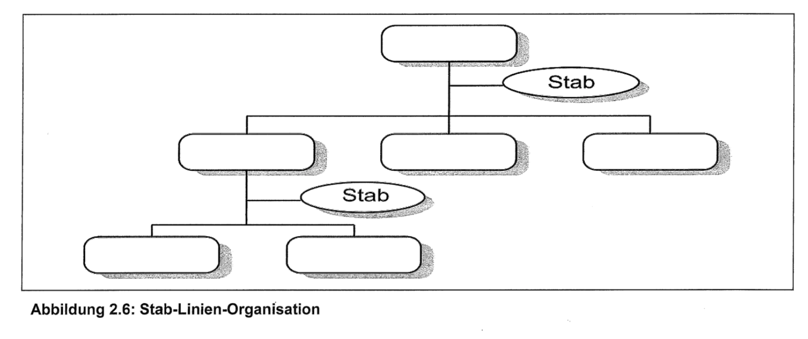
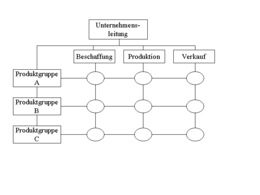

# Organigramm

## TOC
- [Organigramm](#organigramm)
  - [TOC](#toc)
  - [Einlinienorganisation](#einlinienorganisation)
  - [Mehrlinienorganisation](#mehrlinienorganisation)
  - [Stablinienorganisation](#stablinienorganisation)
  - [Matrixorganisation](#matrixorganisation)

## Einlinienorganisation

Merkmale:

- Jeder Mitarbeiter hat genau eine übergeordnete Instanz (klare Befehlskette).

- Autorität und Verantwortung sind klar geregelt.

- Kommunikation erfolgt von oben nach unten.

> Vorteile:\
> ✔ Klare Zuständigkeiten und Verantwortlichkeiten.\
> ✔ Einfache Entscheidungswege.

> Nachteile:\
> ✘ Lange Informationswege.\
> ✘ Überlastung der Führungskräfte.

Beispiel:\
Ein kleines Unternehmen mit einer klaren Hierarchie:

> Geschäftsführer → Abteilungsleiter → Teamleiter → Mitarbeiter

## Mehrlinienorganisation

Merkmale:

- Mitarbeiter haben mehrere Vorgesetzte (z. B. nach Fachbereichen).

- Weisungsbefugnis ist auf mehrere Personen verteilt.

> Vorteile:\
> ✔ Spezialisten haben direkte Weisungsbefugnis (Expertenwissen wird genutzt).\
> ✔ Schnellere Kommunikation innerhalb von Fachbereichen.

> Nachteile:\
> ✘ Überschneidungen und Konflikte zwischen Vorgesetzten.\
> ✘ Höherer Abstimmungsaufwand.

Beispiel:\
Ein Maschinenbauunternehmen, bei dem Ingenieure sowohl dem Produktionsleiter als auch dem Entwicklungsleiter unterstehen.

## Stablinienorganisation

Merkmale:

- Kombination aus Einlinienorganisation mit zusätzlichen Stabsstellen.

- Stabsstellen haben beratende Funktion, aber keine Weisungsbefugnis.

> Vorteile:\
> ✔ Entlastung der Führungskräfte durch Expertenwissen.\
> ✔ Bessere Entscheidungsgrundlagen.

> Nachteile:\
> ✘ Stabsstellen haben keine direkte Entscheidungsgewalt.\
> ✘ Gefahr, dass Stäbe zu viel Einfluss nehmen.

Beispiel:\
Ein Unternehmen mit einem Geschäftsführer, der von einem Rechtsberater und einem Controlling-Team unterstützt wird.

## Matrixorganisation

Merkmale:

- Kombination aus funktionaler und projektbezogener Organisation.

- Mitarbeiter haben zwei oder mehr Vorgesetzte (z. B. Abteilungsleiter & Projektleiter).

> Vorteile:\
> ✔ Hohe Flexibilität in Projekten.\
> ✔ Effiziente Ressourcennutzung.

> Nachteile:\
> ✘ Hoher Abstimmungsbedarf zwischen den Vorgesetzten.\
> ✘ Gefahr von Kompetenzkonflikten.

Beispiel:\
Ein Automobilkonzern, in dem ein Ingenieur sowohl dem Entwicklungsleiter als auch einem Projektleiter für ein neues Fahrzeugmodell untersteht.

